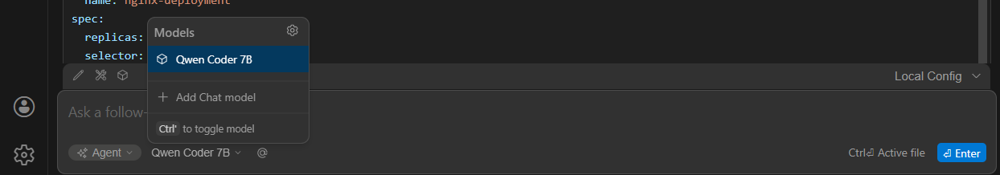

# Local AI Coding Setup using Ollama + VS Code (Continue Extension)

## 1. Introduction

This guide explains how to set up a local AI coding assistant using Ollama and VS Code Continue extension. It enables offline development, privacy, and zero API cost.

## 2. Prerequisites

- VS Code installed
- Ollama installed
- Basic terminal knowledge

## 3. Ollama Setup

Start server:
```bash
ollama serve
```

If error 'Only one usage...' appears, it means Ollama is already running.

Verify:
```bash
curl http://localhost:11434
```

Check models:
```bash
ollama list
```

## 4. Model Installation

Pull model:
```bash
ollama pull qwen2.5-coder:7b
```

## 5. VS Code Setup

Install Continue extension from VS Code marketplace.

## 6. Continue Configuration (YAML)

Use below config including autocomplete. See [continue-config.yaml](config/continue-config.yaml)

## 7. Keyboard Shortcuts (Continue)

- `Ctrl + L` → Open chat
- `Ctrl + I` → Edit selected code
- `Ctrl + Shift + P` → Open command palette
- `Tab` → Accept autocomplete suggestion
- `Esc` → Cancel suggestion

## 8. Usage Examples

**Example 1:**
Write a Kubernetes deployment YAML for nginx

**Example 2:**
Change replicas to 3

## 9. Proof of Working Setup




## 10. Performance

Local models are slower than cloud (Copilot) due to CPU usage. GPU improves performance.

## 11. Use Cases

- Kubernetes YAML generation

- Bash scripting

- Code refactoring

- Python coding

## 11. Future Improvements

- GPU acceleration

- Better models

- MCP integration

## 12. Conclusion

This setup enables a fully local AI assistant suitable for DevOps and development use cases.
